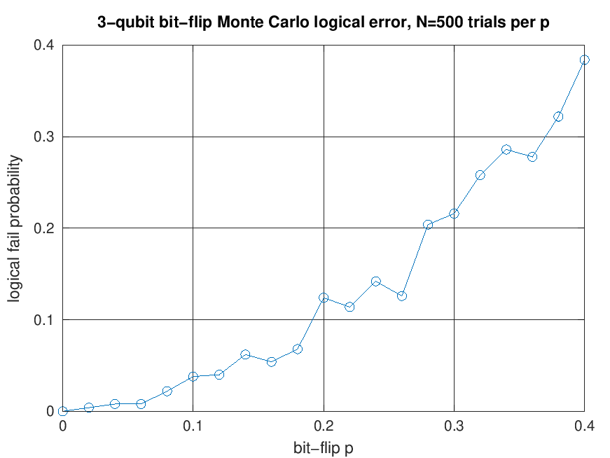
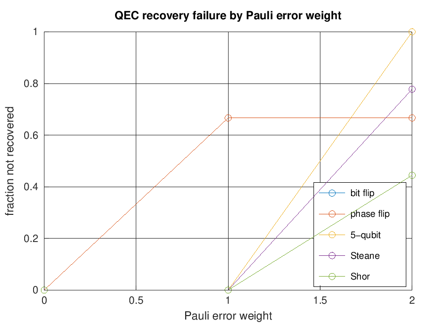
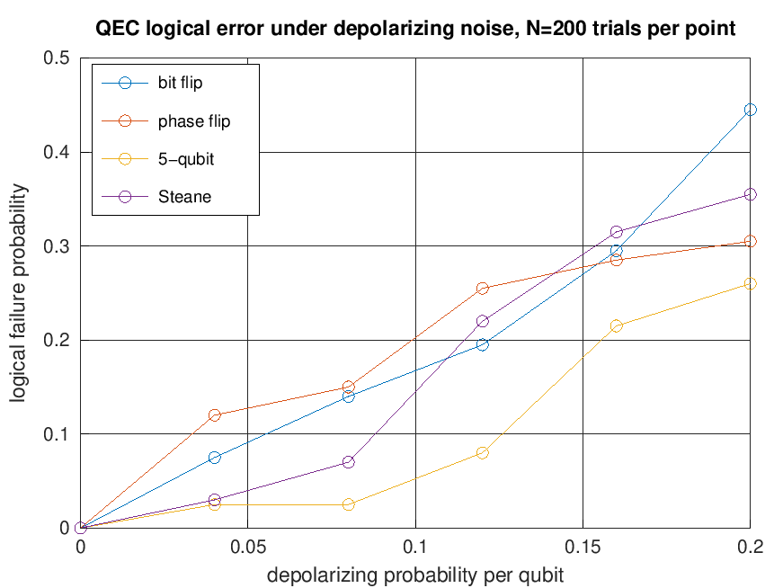
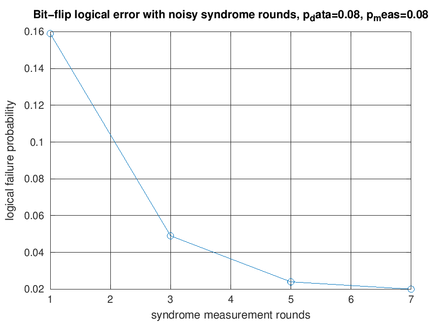
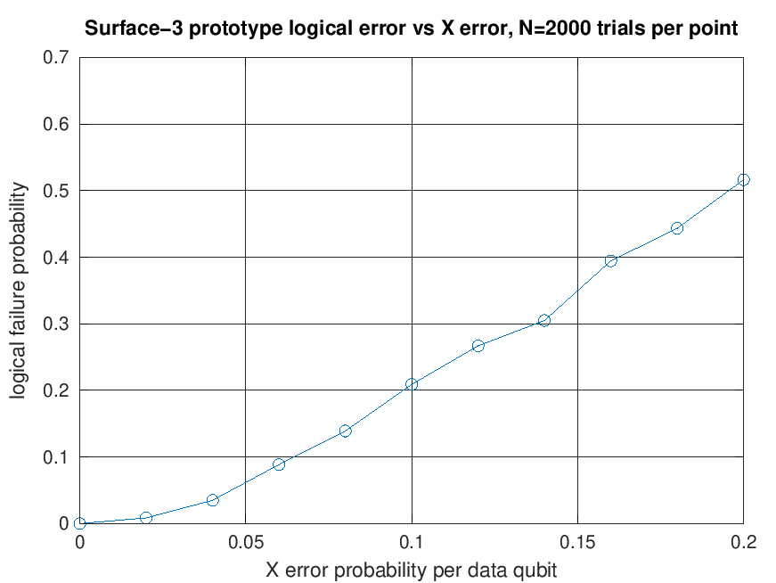
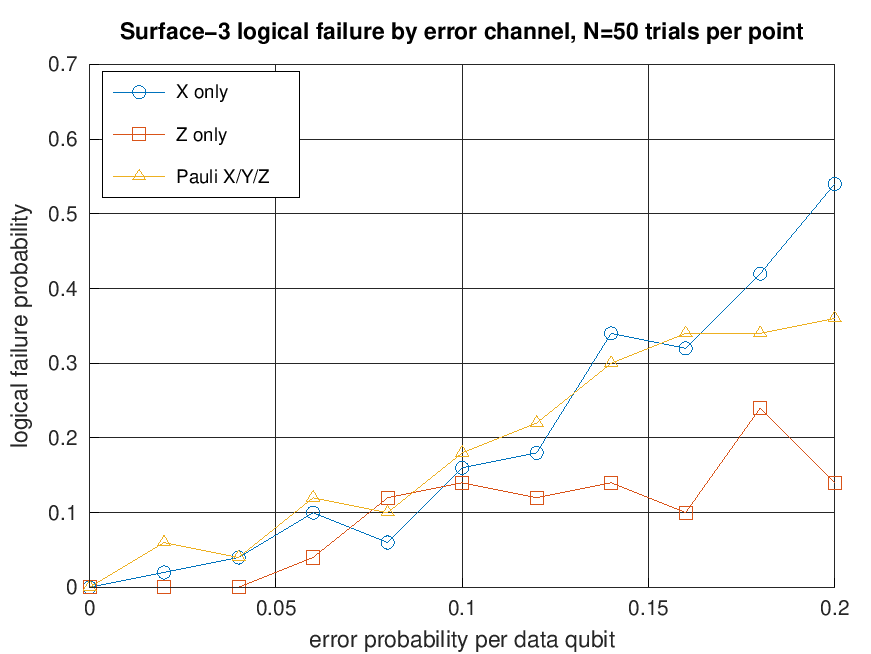
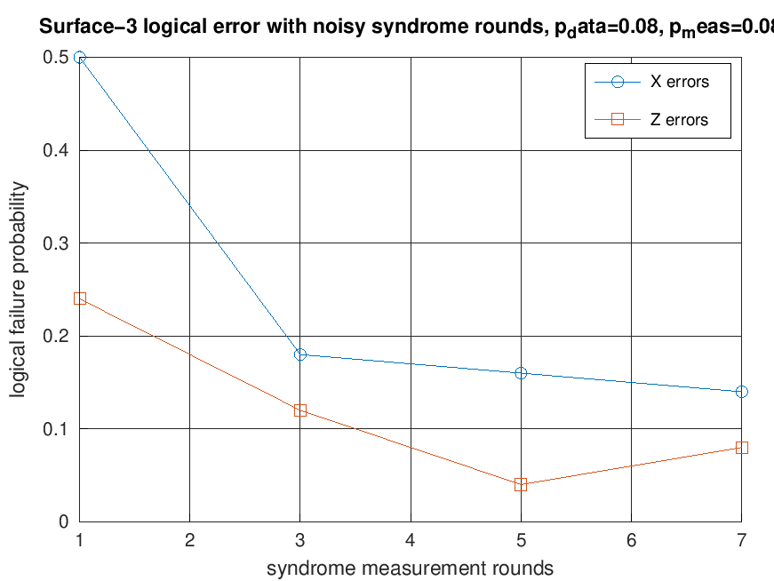
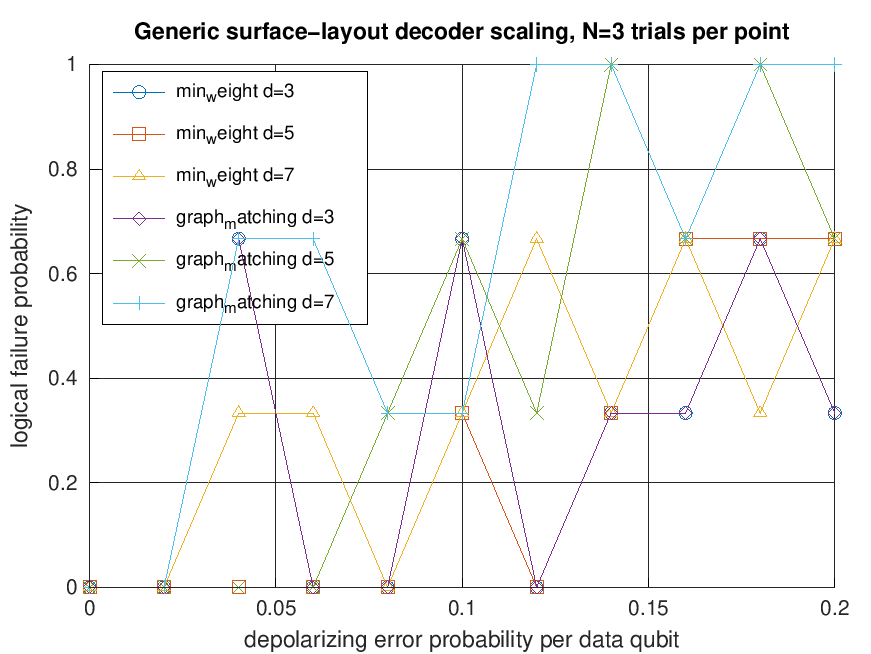

# Results

This document summarizes the generated outputs in `images/` and the behavior each script is intended to show. The exact recovery checks live in `tests/` and can be run with:

```bash
octave --no-gui tests/run_all_tests.m
```

The compact generated table in `docs/SIMULATION_REPORT.md` can be refreshed with:

```bash
octave --no-gui examples/generate_simulation_report.m
```

All figures can be regenerated with:

```bash
octave --no-gui examples/run_all_plots.m
```

## Exact Recovery Coverage

The test suite checks that the implemented distance-3 codes recover arbitrary logical states after correctable single-qubit errors:

| Code | Error model checked | Expected behavior |
| --- | --- | --- |
| 3-qubit bit-flip repetition | Single `X` errors | Recovers the encoded logical state |
| 3-qubit phase-flip repetition | Single `Z` errors | Recovers the encoded logical state |
| 5-qubit perfect code | Single-qubit `X`, `Y`, or `Z` errors | Recovers the encoded logical state |
| 7-qubit Steane code | Single-qubit `X`, `Y`, or `Z` errors | Recovers the encoded logical state |
| 9-qubit Shor code | Single-qubit `X`, `Y`, or `Z` errors | Recovers the encoded logical state |
| 3x3 Bacon-Shor subsystem code | Single-qubit `X`, `Y`, or `Z` errors | Produces a non-logical Pauli-frame residual |
| Surface-3 prototype | Single `X`, `Z`, or `Y` errors on 9 data qubits | Returns to the zero-syndrome class without a logical residual |

## Bit-Flip Repetition Code

The 3-qubit repetition examples are the smallest end-to-end demonstrations of syndrome extraction, correction, and Monte Carlo logical-error estimation.

### Logical Error Probability

`images/bitflip_logical_error_vs_physical_error.png`

<p align="center">
  
</p>

This sweep shows quadratic suppression at small physical error probability. The analytic logical failure probability for independent bit flips is:

```text
P_fail = 3p^2(1-p) + p^3
```

### Syndrome Histogram

`images/bitflip_syndrome_distribution.png`

<p align="center">
  
</p>

The histogram shows how syndrome outcomes identify the most likely single-qubit flip without measuring the logical value directly.

### Decoder Confusion Matrix

`images/bitflip_decoder_confusion_matrix.png`

<p align="center">
  
</p>

Rows are true error patterns and columns are inferred corrections. Diagonal entries represent correct single-error identification; off-diagonal entries come from ambiguous multi-error patterns.

### Error-Weight Distribution

`images/bitflip_error_weight_distribution.png`

<p align="center">
  
</p>

This plot explains why the repetition code works well at small `p`: weight-0 and weight-1 events dominate. Weight-2 and weight-3 events become the logical-failure contribution as `p` grows.

### Monte Carlo Demo

`images/bitflip_monte_carlo_demo.png`

<p align="center">
  
</p>

This example provides a compact visual run of the bit-flip simulation workflow.

## Multi-Code Recovery Comparison

`images/qec_recovery_failure_by_error_weight.png`

<p align="center">
  
</p>

This figure compares exact Pauli-recovery behavior by error weight across the implemented codes. The distance-3 codes are expected to handle all single-qubit Pauli errors and to fail on some higher-weight patterns.

## Depolarizing Noise Sweep

`images/qec_depolarizing_logical_error_comparison.png`

<p align="center">
  
</p>

This Monte Carlo sweep applies independent depolarizing noise and estimates logical failure after recovery. It is a simple state-vector noise model, not a circuit-level threshold simulation.

## Noisy Syndrome Rounds

`images/bitflip_noisy_syndrome_rounds.png`

<p align="center">
  
</p>

This plot models classical readout errors in the reported bit-flip syndrome. Repeating syndrome extraction and aggregating the result reduces readout-induced decoder mistakes. The noisy-syndrome trial output includes both raw syndrome history and detector-history differences between adjacent rounds.

## Surface-3 Prototype

`images/surface3_logical_error_vs_x_error.png`

<p align="center">
  
</p>

The surface-code example is a compact 9-data-qubit code-capacity model using Z-check syndromes for X errors, X-check syndromes for Z errors, cached minimum-weight lookups, and repeated noisy syndrome readout. It also includes a lightweight circuit-level schedule prototype with 8 ancillas, data errors between rounds, and hook-like gate faults for studying how measurement order can affect residual errors.

`images/surface3_channel_logical_error_comparison.png`

<p align="center">
  
</p>

This comparison shows X-only, Z-only, and independent Pauli X/Y/Z logical failure estimates for the same compact surface-3 layout.

`images/surface3_noisy_syndrome_rounds.png`

<p align="center">
  
</p>

This plot models classical readout errors on surface-3 syndrome bits. Each syndrome bit is measured repeatedly and majority-voted before decoding. Surface-3 noisy-syndrome and circuit-level trials expose detector-history matrices alongside the raw measurement history.

## Generic Surface-Layout Decoder Scaling

`images/surface_distance_logical_error_scaling.png`

<p align="center">
  
</p>

This benchmark compares the variable-distance square-layout decoder for `d = 3`, `d = 5`, and `d = 7` under the same code-capacity Pauli noise model. It now plots the default cached lookup plus peeling decoder alongside a bounded syndrome-graph baseline. The graph baseline is exact only within its searched candidate weight; the peeling branch is a compact heuristic for unresolved larger-distance syndromes.

## Generated Report

`docs/SIMULATION_REPORT.md` contains a small, reproducible Markdown table generated by `examples/generate_simulation_report.m`. It uses intentionally low sample counts so it can run quickly in CI.

## Key Takeaways

- The repetition-code examples demonstrate the basic QEC loop: encode, apply noise, measure syndrome, correct, and estimate logical failure.
- The 5-qubit, Steane, and Shor implementations verify exact recovery for every single-qubit Pauli error.
- The depolarizing and noisy-syndrome examples are lightweight educational simulations, not hardware-calibrated noise models.
- The surface-3 code now supports X-only, Z-only, combined Pauli code-capacity simulations, repeated noisy syndrome readout, and a compact circuit-level schedule prototype.
- The generic surface-layout path now includes d=3/5/7 benchmark scripts with configurable trial count, seed, physical error range, and decoder list.

---

## Citation

If you use this repository in a project, cite it as:

Sid Richards (2026). `Quantum_Error_Correction`: MATLAB/Octave implementations of quantum error-correction codes and simulations.

## Author

Sid Richards

- LinkedIn: [sid-richards-21374b30b](https://www.linkedin.com/in/sid-richards-21374b30b/)
- GitHub: [SidRichardsQuantum](https://github.com/SidRichardsQuantum)

## License

MIT. See [LICENSE](LICENSE).
