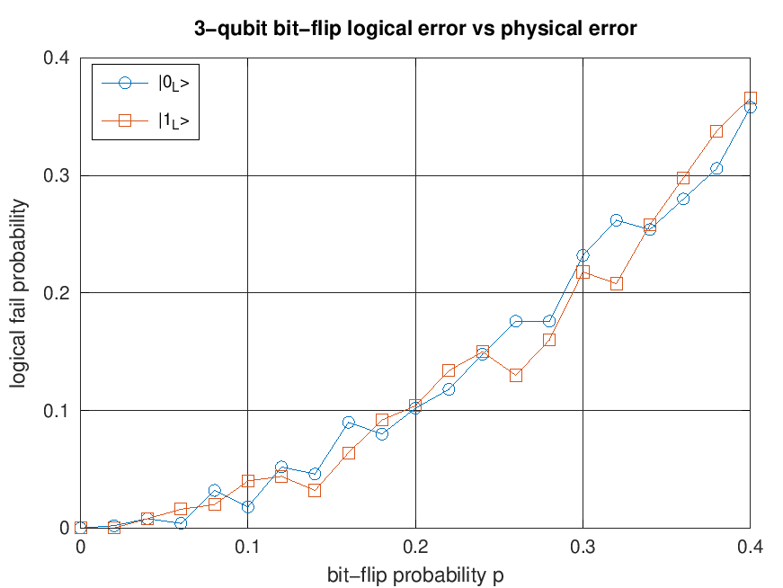
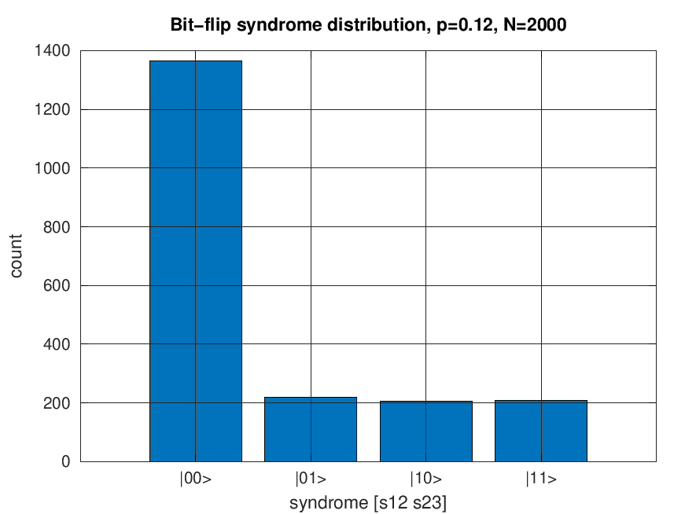
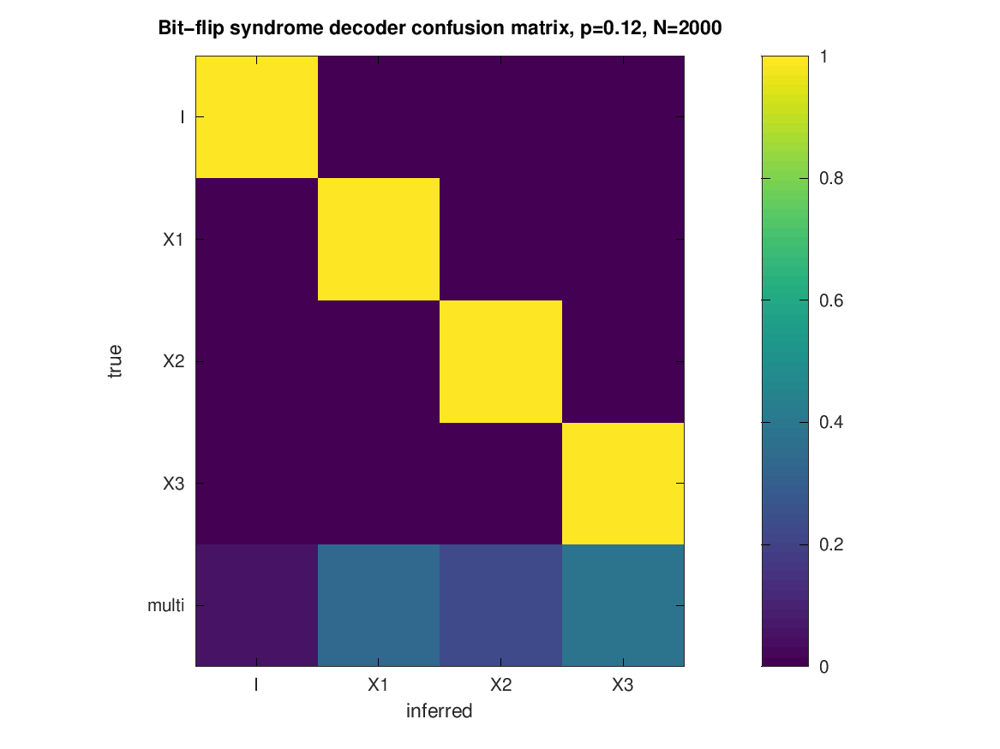
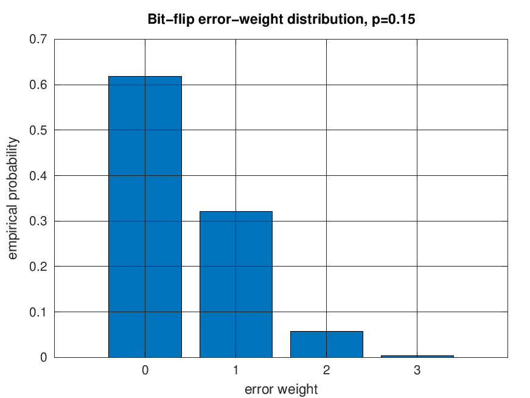

# Results: Quantum Error Correction (3-Qubit Repetition Code)

This document records the output of the simulations and the meaning of each figure.

## 1. Logical Error Probability vs Physical Error Probability

- Shows how the logical failure rate depends on the physical bit-flip probability `p`.  
- Confirms quadratic suppression of errors: for small `p`, the logical error scales like `p²`.  
- At large `p`, error correction fails (logical error approaches 0.5, the random-guess limit).

<p align="center">
  
</p>

## 2. Syndrome Frequency Histogram

- Histogram of stabilizer measurement outcomes (`|00>`, `|01>`, `|10>`, `|11>`) in order.  
- Each peak corresponds to the most likely single-qubit error.  
- Demonstrates that syndrome extraction reveals which qubit flipped without collapsing the logical state.

<p align="center">
  
</p>

## 3. Confusion Matrix

- Rows: true error pattern (`I, X1, X2, X3`).  
- Columns: inferred error pattern from syndrome.  
- Diagonal dominance shows that correction is reliable for single flips.  
- Off-diagonal entries correspond to ambiguous cases (two or more flips).

<p align="center">
  
</p>

## 4. Error-Weight Distribution

- Probability distribution over 0, 1, 2, or 3 flips.  
- At small `p`, weight 0 and weight 1 dominate.  
- At larger `p`, weight 2 and weight 3 contribute significantly, explaining the rise in logical error.

<p align="center">
  
</p>

## 5. Key Takeaways

- The 3-qubit code effectively reduces error rate from `O(p)` to `O(p²)` at small `p`.  
- Logical protection breaks down when `p` exceeds ~0.1–0.2.  
- Simulation results match the analytic expression:

```
P_\text{fail} = 3p²(1-p) + p³
```

## 6. Additional Simulation Outputs

The repository also includes scripts that generate:

- `images/qec_recovery_failure_by_error_weight.png`: exact low-weight Pauli recovery comparison across codes.
- `images/qec_depolarizing_logical_error_comparison.png`: logical failure under independent depolarizing noise.
- `images/bitflip_noisy_syndrome_rounds.png`: impact of repeated noisy syndrome measurement rounds.
- `images/surface3_logical_error_vs_x_error.png`: logical failure for the compact surface-code prototype.

---

📘 Author: Sid Richards (SidRichardsQuantum)

 LinkedIn: https://www.linkedin.com/in/sid-richards-21374b30b/

This project is licensed under the MIT License - see [../LICENSE](../LICENSE).
